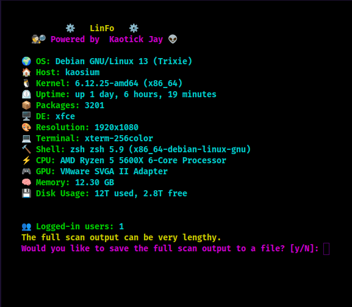

# LinFo
 🌟 Introducing LinFo v0.1: Your Ultimate System Info Companion! 🌟

🔮 Are you curious about your system's inner secrets? Want to know everything about your Linux environment? Look no further! We present to you LinFo, the magical script that unveils all the hidden details about your system!

🌈 With LinFo, prepare to embark on a journey of discovery, where every command reveals a delightful surprise. It's like having your own personal detective, only cooler!

🔍 Powered by the enigmatic KaotickJ 👽, LinFo is here to transform your terminal experience into a mesmerizing adventure.

🏰 Picture this: As you run LinFo, a world of colorful information unfolds before your eyes, with dazzling details that will leave you in awe. Let's take a quick tour of what awaits you:

🐧 OS: Immerse yourself in the realm of operating systems as LinFo reveals the enchanting name of your Linux distro.

🏠 Host: Uncover the identity of your mysterious host. It's like meeting a new friend from a parallel universe!

🌽 Kernel: Experience the power of the Linux kernel as LinFo uncovers its version.

⏲️ Uptime: Discover the age of your system, as LinFo tells you how long it has been alive and kicking!

📦 Packages: Be amazed by the vast array of packages that have found their way onto your system.

🖥️ Desktop: Enter the world of desktop environments and find out which one is currently dancing on your screen.

🖼️ Window Manager: Step into the world of window management with LinFo's Window Manager feature. Discover the elegant and efficient manager that controls the placement and appearance of your application windows. Whether it's tiling, stacking, or floating, LinFo unveils the magic behind this essential component of your Linux desktop experience.

🎭 Theme: Prepare to be dazzled by LinFo's Theme revelation! Immerse yourself in a symphony of colors, shapes, and styles as LinFo uncovers the captivating theme that adorns your desktop environment. From sleek and minimalist to vibrant and eye-catching, your theme sets the mood for your Linux journey.

🎨 Icons: Uncover the icons that breathe life into your desktop environment with LinFo's Icons feature. Each icon tells a story and adds personality to your Linux experience. Let LinFo unveil the beautiful and diverse collection of icons that adorn your system, making every interaction a visual delight.

📐 Resolution: Marvel at the resolution of your display, making every pixel burst with vibrant colors!

💻 Terminal: Unveil the secret identity of your trusted terminal companion.

🔨 Shell: Discover the magical shell that grants you the power to wield commands like a wizard.

⚡️ CPU: Behold the mighty CPU that fuels your adventures in the digital realm.

🎮 GPU: Get ready to explore the graphic wonders of your system with LinFo's GPU revelation.

🧠 Memory: Dive into the vast depths of your system's memory, where every byte has a story to tell.

💾 Disk Usage: Explore the usage of your disk, witnessing the delicate balance between used and free space.

But wait, there's more! LinFo is not just about numbers and technicalities. It's also about connections and networks! Brace yourself as LinFo introduces you to the vast web of interfaces, connecting you to the world beyond your imagination!

And now, prepare for the grand finale! 🎉🎉🎉

🎈🎈🎈 You'll float too! 🎈🎈🎈

🌟 Yes, that's right! LinFo's grand finale will leave you floating with joy and excitement. As the colors explode on your screen, and the captivating banner fills the terminal, you'll experience a moment of pure exhilaration! It's a celebration of knowledge and discovery, and LinFo invites you to be part of it!

So, what are you waiting for? Embark on this extraordinary adventure with LinFo and let your curiosity soar to new heights! Run the script, embrace the magic, and let the world of your Linux system unfold before your eyes!

⚙️ LinFo: Unveiling the Magic of Your Linux System! ⚙️

|       |
| ----- |
|  |
|       |